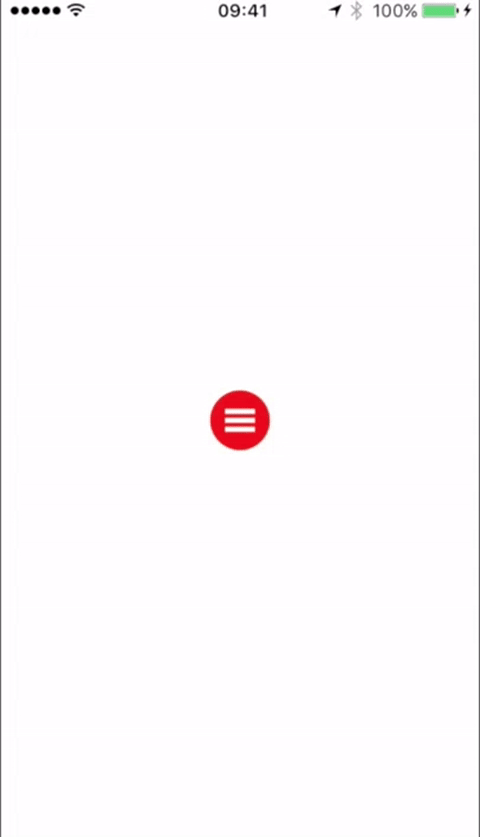

# Fa-Hsu Lin (Rice) - iOS Developer

## Summary
Mobile devices are now changing our lives. 

Eating, shopping, working, traveling, even sleeping, people are now experencing their lives in new ways.

And I think I could be one of the changers.

These fantastic Apps are bringing us to a better, faster, and more convinent world.

***Change the world?  I'm in!***

## On the Apple Appstore
* [ToBeOne](https://itunes.apple.com/tw/app/tobeone/id1146702300?mt=8)
* [HOBOT](https://itunes.apple.com/tw/app/hobot/id1084602291?mt=8)
* [大魯閣MALL](https://itunes.apple.com/tw/app/da-lu-gemall/id1034758888?l=zh)
* [遠東百貨](https://itunes.apple.com/tw/app/yuan-dong-bai-huo/id978576574?l=zh)
* [士林靈糧堂SLLLC](https://itunes.apple.com/tw/app/shi-lin-ling-liang-tangslllc/id1070724395?mt=8)
* [银联台湾](https://itunes.apple.com/hk/app/yin-lian-tai-wan/id1104901477?l=zh&mt=8)

## Demo Apps
* RLMenuButtons

	

* RLTextField & RLTableView

	

* Work Hour Tracker (ongoing)

## Skills
* Swift
* Objective-C
* Human Resource Management
* Employee Training
* Project Management
* Business Strategy
* Marketing Management

## Language
* Mandarin
* Taiwanese
* English

## Experience
* iOS Developer @ SpreadSun 2016.03 - 2016.08

	> Develop an EC App and a social video App.
	
* iOS Developer @ Zoaks Co., Ltd. 2015.11 - 2016.03

	> Develop Apps to satisfy clients' variable needs.

* Barista @ MT 49 Café	2015.03 - 2015.07

	> Serve customers and general bar affairs.
	
* Duty Manager @ Zakuzaku Café 2014.11 - 2015.03

	> Staff management.
	
	> Purchase and inventory control.

	> Design serving process.

	> General affairs like schedule rosters, statement analysis...etc.
	
	> Serve customers.
	
* Backpacker @ Australia Working Holiday 2012.08 - 2014.08

	> Explore the great Australia and experiencing the culture.
	
* Sales person @ GALUXE OPTICS CO., LTD 2011.07 - 2012.06

	> Sale binoculars to retails and government departments.
	
* Military - 2010.08 - 2011.07

	> Classified.

## Education
* Bachelor of Business Administration (HR Group) - Fu Jen Catholic University, Taiwan (2010)

	> Attended Student Association.
	
	> Hold at least 4 camps for high school students.

## Contact
* E-mail : [rice0617@gmail.com](mailto:rice0617@gmail.com)
* Linkedin : [Fa-Hsu Lin](https://www.linkedin.com/in/fa-hsu-lin-1b35b5120)
